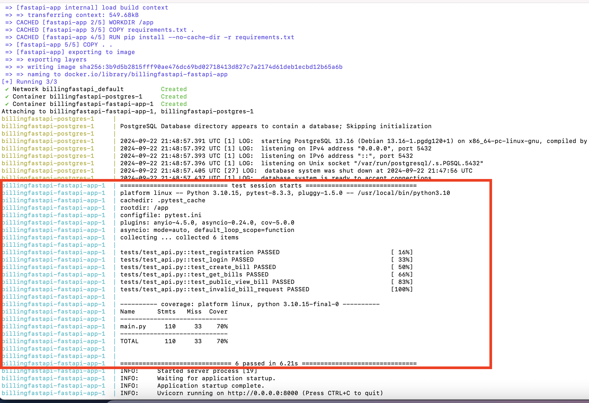
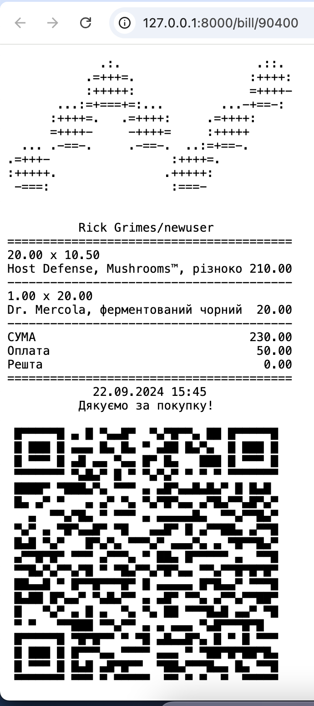
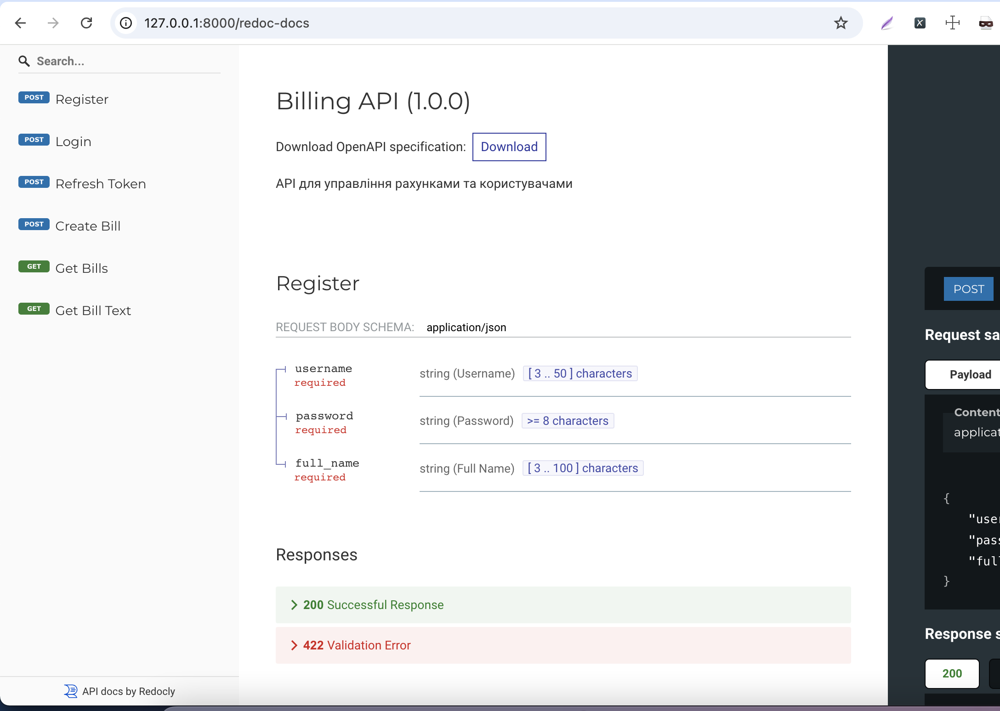

# BillingFastAPI
This FastAPI application is a billing management system. It provides endpoints for user registration, authentication, and allows users to create, view, and manage their bills. The application is designed to support filtering, and offers functionality to display bills in a text-based format that can be accessed by unauthenticated users.
## Setup

### 1. Clone the repository:

```bash
git clone https://github.com/Madaocv/BillingFastAPI.git
cd BillingFastAPI
```
### 2. Building and Running the service command:

```bash
docker-compose up --build
```

*Test coverage report*

## Usage

### 1. cURL for registration:
```bash
curl -X POST "http://127.0.0.1:8000/register" \
-H "Content-Type: application/json" \
-d '{"username": "newuser", "password": "newpassword", "full_name": "Rick Grimes"}'
```
### 2. cURL for login:
```bash
curl -X POST "http://127.0.0.1:8000/login" \
-H "Content-Type: application/json" \
-d '{"username": "newuser", "password": "newpassword"}'
```
### 3. cURL refresh expired token:
```bash
curl -X POST "http://127.0.0.1:8000/refresh-token" \
-H "Content-Type: application/json" \
-d '{"refresh_token": "your_refresh_token_here"}'
```
### 4. cURL create bill:
```bash
curl -X POST "http://127.0.0.1:8000/bill" \
-H "accept: application/json" \
-H "Authorization: Bearer <your_access_token>" \
-H "Content-Type: application/json" \
-d '{
    "products": [
        {
            "name": "Host Defense, Mushrooms™, різнокольоровий трутовик, 120 вегетаріанських капсул (FPI-02733)",
            "price": 10.5,
            "quantity": 2
        },
        {
            "name": "Dr. Mercola, ферментований чорний часник, 60 капсул (MCL-01582)",
            "price": 5.0,
            "quantity": 1
        }
    ],
    "payment": {
        "type": "nano",
        "amount": 50.0
    }
}'
```
### 5. cURL filter bills:
```bash
curl -X GET "http://127.0.0.1:8000/bills?min_total=10&max_total=10000&payment_type=cash&date_from=2024-01-01&date_to=2025-02-20&limit=2&offset=0" \
-H "Authorization: Bearer YOUR_ACCESS_TOKEN"
```
### 6. cURL bill text representation:
```bash
curl -X GET "http://127.0.0.1:8000/bill/12345"
```

*Text bill view*

## API Documentation

### Documentation with Swagger UI (call and test your API directly from the browser) is available at URL: http://127.0.0.1:8000/swagger

*Swagger UI*
### Documentation with ReDoc is available at URL: http://127.0.0.1:8000/redoc-docs

*ReDoc*